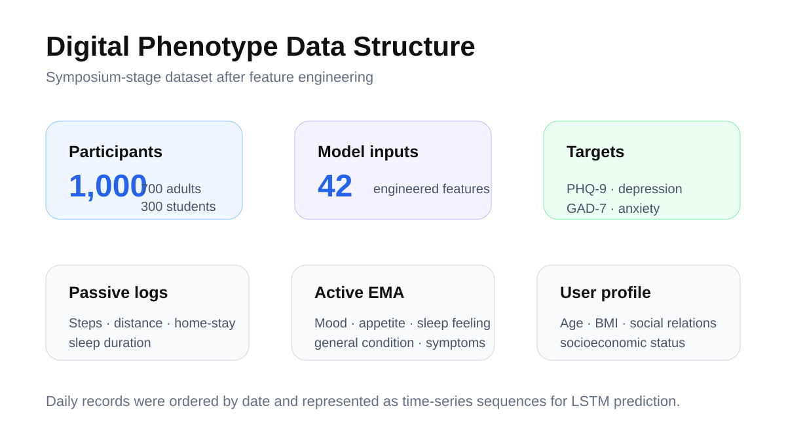
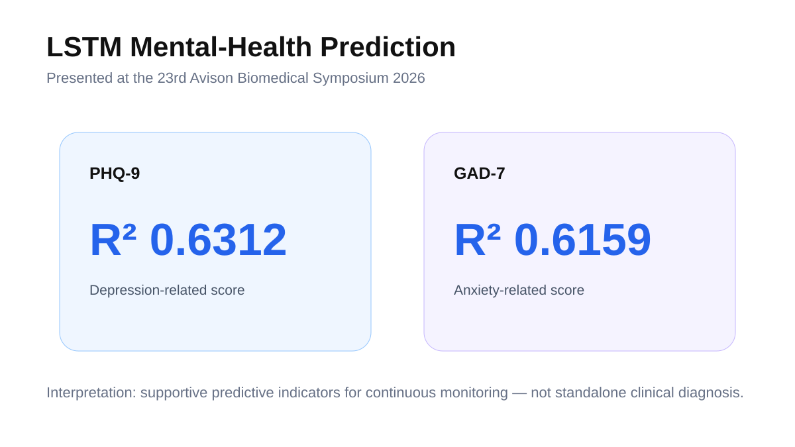
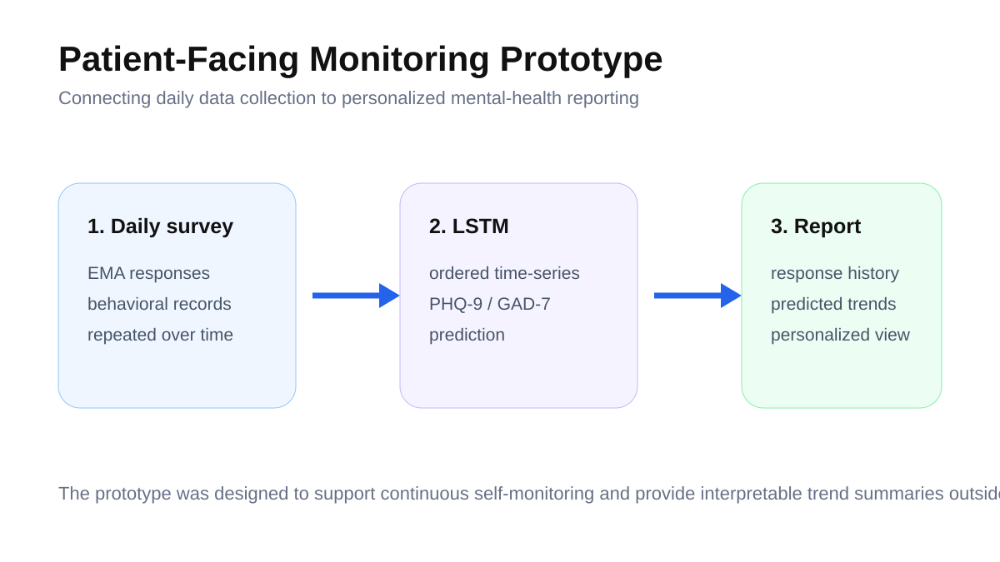

# Digital Phenotype-Based Mental Health Monitoring & Prediction Using LSTM

> Time-series mental-health prediction from digital phenotype / EMA data, connected to a patient-facing monitoring and reporting prototype.

**Project progression:** Yongin Severance Digital Healthcare Hackathon (May 2025) → 23rd Avison Biomedical Symposium 2026 (Jun. 2026)  
**Role in hackathon:** Team lead · Machine Learning Modeling · Data Preprocessing  
**Recognition:** **Grand Prize**, Yongin Severance Hospital Digital Healthcare Hackathon  
**Core method:** LSTM

---

## Overview

This project began as a digital-healthcare hackathon solution and was developed into a research presentation on continuous mental-health monitoring. The central idea is to combine repeated real-world behavioral / EMA information with standardized mental-health outcomes so that mental-health state can be modeled as a **time-series process** rather than a single point-in-time survey.

## Data structure

The symposium version used:

- **1,000 participants**: 700 general adults + 300 college students
- **42 model input features** after feature engineering
- Passive logs: step count, distance, home-stay time, sleep duration
- Active EMA: mood, appetite, sleep feeling, general condition, symptoms
- User profile variables such as age, BMI, social relationships, and socioeconomic status
- Target scores: **PHQ-9** and **GAD-7**

Daily records were ordered by date and modeled as time-series sequences.

## LSTM prediction

The LSTM was used to learn longer-term changes in participant state from ordered daily observations.

| Outcome | Test R² |
|---|---:|
| PHQ-9 | **0.6312** |
| GAD-7 | **0.6159** |

These results were presented as supportive predictive indicators for monitoring rather than standalone clinical diagnoses.

## Application prototype

The project also connected the prediction pipeline to a mobile-service concept for daily input, trend visualization, and personalized reporting.

The prototype included daily survey collection and personalized displays of response history / predicted mental-health trends.

## My contribution

The hackathon team slide identifies Junha Won as **team lead**, responsible for:

- Machine-learning modeling
- Data preprocessing
- Overall project coordination / healthcare-service planning

The later symposium work extended the modeling and research presentation around time-series prediction and personalized reporting.

## Project outputs

- [`outputs/PROJECT_OUTPUTS.md`](outputs/PROJECT_OUTPUTS.md) - source provenance and public-safe evidence from the hackathon, award, and Avison symposium stages.

## Data & privacy

No participant-level mental-health records are redistributed. Figures in this repository are presentation-level aggregates / diagrams and prototype-flow reconstructions.

---

**Junha Won** · Ajou University  
[Portfolio](https://juna0926.github.io/Portfolio/) · [GitHub](https://github.com/Juna0926)
